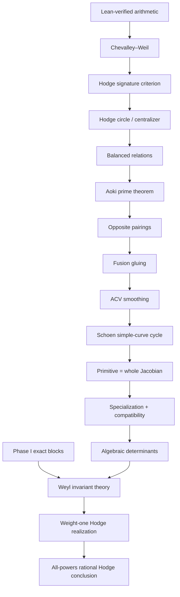

# Dependency graph

The core never imports the bridge. The bridge imports the core and composes
ordinary theorem arguments; none of the arrows below is installed as a global
postulate.

## Published interfaces

The `PublishedInputs` bundle has seven separately named fields:

| Lean field | Intended mathematical input | Scope warning |
|---|---|---|
| `chevalleyWeil` | Prime cyclic-cover eigenspace multiplicities | The Lean core verifies only the resulting integer arithmetic. |
| `aokiPrime` | Prime balanced tuples are simple/opposite-paired | Supplied as a theorem parameter, not proved here. |
| `acvSmoothing` | Balanced twisted/admissible-cover smoothing | Must match the precise characteristic-zero tame hypotheses. |
| `schoenSimpleCurve` | Schoen's algebraicity result for a simple tuple | Schoen's theorem is about the simple curve/primitive factor interface. |
| `chowSpecialization` | General existence of specialization for cycles | Exact determinant compatibility remains research-specific. |
| `weylInvariantTheory` | First fundamental theorem for the relevant standard/dual blocks | No representation-theory library is imported here. |
| `abelianHodgeRealization` | Passage from tensor invariants to Hodge classes on powers | Requires the exact weight-one and projector formalism. |

Primary references highlighted by the manuscript include
[Schoen 1988](https://www.numdam.org/item/CM_1988__65_1_3_0.pdf) and
[Abramovich–Corti–Vistoli](https://arxiv.org/abs/math/0106211).

## Research interfaces

The `ResearchInputs` bundle is deliberately separate:

| Lean field | Unformalized manuscript bridge |
|---|---|
| `phaseIExactBlocks` | Exact derived monodromy blocks and algebraic Kummer matrix units. |
| `hodgeCircleAndCentralizer` | Identification of the generic central torus with the signature annihilator. |
| `fusionGluing` | Global construction of the balanced compact-type cover from all pairings. |
| `primitiveEqWholeForPrimeP1` | Identification of Schoen's primitive factor with the whole prime cyclic `P¹` Jacobian. |
| `specializationCompatibility` | Exact `K`-linear identification of the specialized determinant tensor. |

The theorem `rationalHodge_allPowers_of_inputs` is therefore useful as a
machine-readable checklist, not evidence that these five fields have proofs.
