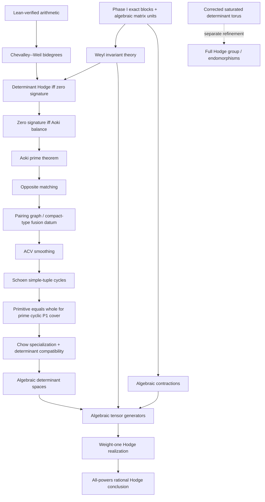

# Dependency graph

The core never imports the bridge. The current bridge is explicitly a
temporary logical scaffold; the concrete replacement criteria are in
`AUDIT_BOUNDARY.md`.

## Why the direct route matters

The all-powers conclusion uses determinant Hodge bidegrees directly. It does
not require a prior computation of the complete central torus. Consequently,
the unsaturated quotient and rank-two character errors recorded as AF-1 and
AF-2 do not enter this headline path.

## Current scaffold fields

`PublishedInputs` has seven citation-level arrows, still awaiting exact
source-scoped statements. `UnformalizedDeductions` has eight
manuscript-specific arrows, each of which must disappear from the final theorem
and be replaced by a proof over concrete objects. In particular,
`phaseIExactBlocks` currently hides most of Phase I and is not an acceptable
final assumption.

See `AUDIT_BOUNDARY.md` for the exact leaf inventory, hidden obligations, and
completion test.
