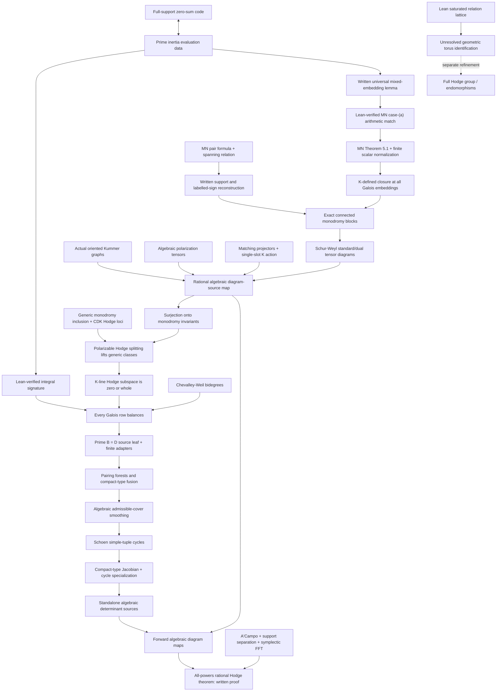

# Target dependency graph

The diagram below is the written mathematical argument in the general and
fusion manuscripts, not a claim that every arrow is a Lean theorem. The core never imports the bridge. The current
bridge is explicitly a temporary logical scaffold; the concrete replacement
criteria are in `AUDIT_BOUNDARY.md`.

## Why the direct route matters

The all-powers conclusion uses a rational algebraic diagram-source map and
Hodge lifting before imposing determinant Hodge bidegrees. It does
not require a prior computation of the complete central torus. Consequently,
the unsaturated quotient and rank-two character errors recorded as AF-1 and
AF-2 do not enter this headline path.

The full-group branch now starts from a proved algebraic correction: the
saturated quotient is torsion-free and compatible signature maps descend.
The remaining geometric work includes identifying the complete integral
character lattice, not merely a rationally isogenous torus; see
`TORUS_REPAIR.md`. The corrected rank-two character is independently proved
in Lean. The general monodromy and generator steps now have written proofs
in `general_all_powers.tex`; their Lean formalization remains unfinished.

## Current interfaces and scaffold

`External/Inputs.lean` now separates the prospective citation-level
assumptions into typed
interfaces for Chevalley--Weil, Deligne, Menet--Nguyen, Andre, Weyl, Aoki, ACV,
Schoen, compact-type Picard, smooth-proper comparison, Chow specialization,
and weight-one realization. These are assumption *types*, not global
postulates; contexts still using erased carrier types advertise that fact.

The exact prime balanced-tuple leaf has additionally been split into the focused
`External/Aoki.lean` module. `Bridge/DeterminantAoki.lean` proves the concrete
finite path from branch-valid signed determinant terms with zero signature at
every nonzero row to `OppositePairingWitness`; only the final balanced-to-paired
step for tuples of length at least four consumes that proposition-valued leaf.
Lean proves the source branch/unit-row adapters and the shorter cases. The
dotted edge from Hodge determinant data to the signed-word model is still a
project obligation.

`External.ProspectiveCitationInputs` is not consumed by the headline scaffold.
The concrete finite continuation now lives in `Bridge/DeterminantFusion.lean`:
repeated determinant factors receive distinct source labels, their residue
concatenation is exact, and source support bounds imply all required fused
bounds and rank preservation. `Verified/ConnectedFusion.lean` constructs a
complete fusion component for connected pairing graphs. General disconnected
component assembly and every cover/Chow realization remain beyond these Lean
results. The standalone manuscript supplies the geometric argument; it is not
silently treated as a formal theorem.

The separate `Bridge.PublishedInputs` has seven logical arrows and
`UnformalizedDeductions` has eight manuscript-specific arrows. Both structures
remain scaffolding. Every manuscript-specific field must disappear from the
final theorem and be replaced by a proof over concrete objects. In particular,
`phaseIExactBlocks` currently hides most of Phase I and is not an acceptable
final assumption.

See `AUDIT_BOUNDARY.md` for the exact leaf inventory, hidden obligations, and
completion test.
