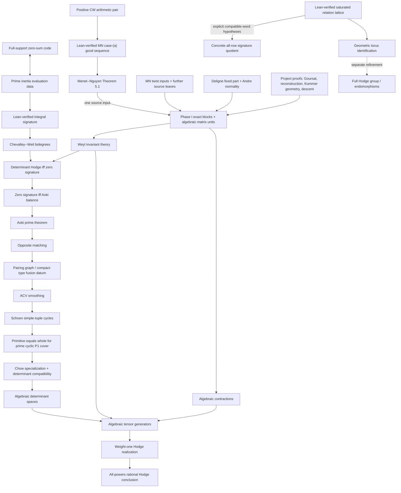

# Target dependency graph

The diagram below is the target mathematical DAG, not a claim that every solid
arrow is already a Lean theorem. The core never imports the bridge. The current
bridge is explicitly a temporary logical scaffold; the concrete replacement
criteria are in `AUDIT_BOUNDARY.md`.

## Why the direct route matters

The all-powers conclusion uses determinant Hodge bidegrees directly. It does
not require a prior computation of the complete central torus. Consequently,
the unsaturated quotient and rank-two character errors recorded as AF-1 and
AF-2 do not enter this headline path.

The full-group branch now starts from a proved algebraic correction: the
saturated quotient is torsion-free and compatible signature maps descend.
Only its identification with the geometric connected central torus remains on
that branch.

## Current interfaces and scaffold

`External/Inputs.lean` now separates the prospective citation-level
assumptions into typed
interfaces for Chevalley--Weil, Deligne, Menet--Nguyen, Andre, Weyl, Aoki, ACV,
Schoen, compact-type Picard, smooth-proper comparison, Chow specialization,
and weight-one realization. These are assumption *types*, not global
postulates; contexts still using erased carrier types advertise that fact.

`External.ProspectiveCitationInputs` is not consumed by the headline scaffold.
The separate `Bridge.PublishedInputs` has seven logical arrows and
`UnformalizedDeductions` has eight manuscript-specific arrows. Both structures
remain scaffolding. Every manuscript-specific field must disappear from the
final theorem and be replaced by a proof over concrete objects. In particular,
`phaseIExactBlocks` currently hides most of Phase I and is not an acceptable
final assumption.

See `AUDIT_BOUNDARY.md` for the exact leaf inventory, hidden obligations, and
completion test.
